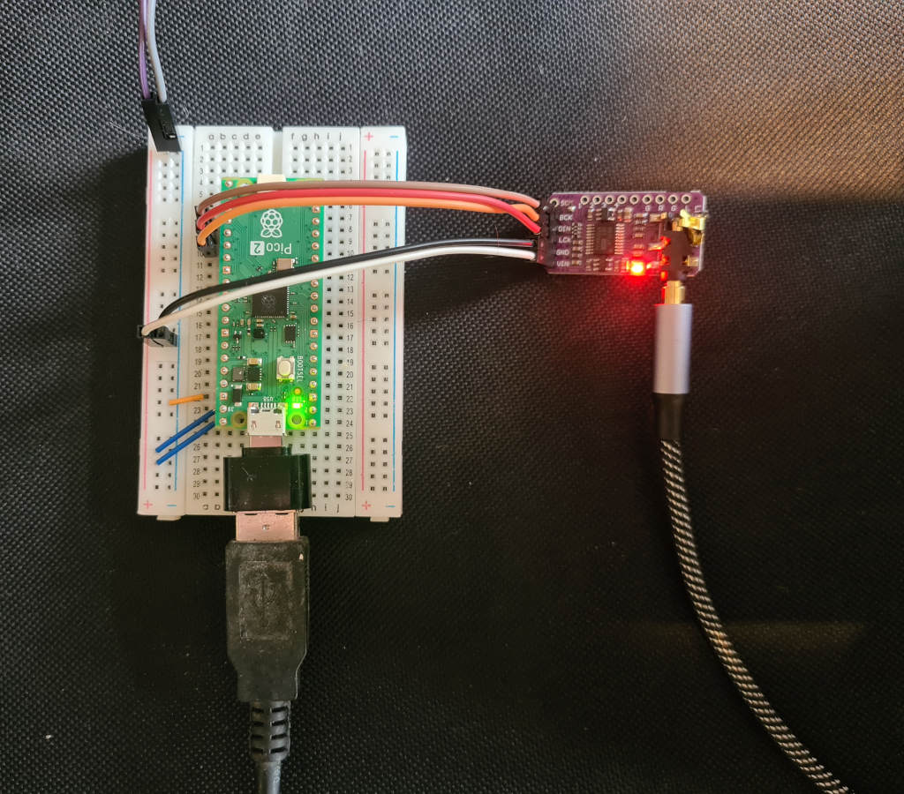

# Oxynth

A Synthesizer written in Rust / [Embassy](https://embassy.dev/) for the
Raspberry Pi Pico 2 microcontroller.

## Overview

A minimal but capable "hardware" synth that can be easily bodged together from
cheap components (£8.66 per unit for the core components, see below). Once
you've wired it up and flashed it you can connect a USB MIDI keyboard and an amp
or headphones, and it's ready to play. The software in this repo gives you a
very basic synth, but if you want something custom you can modify
[synth.rs](./src/synth.rs) to taste.

### Caveats

- I'm fairly inexpert at electronics, Rust and audio synthesis, maybe this
  simple guide will be helpful for other inexperts. If you're looking for
  something advanced or expert, look elsewhere!
- I still need to finish fixing some stuff up and documenting it. These
  instructions should work OK already though
- Some of the code is LLM-assisted. In particular the default `synth.rs` was
  pretty much all spat out by an LLM.

## Hardware

Here's some instructions for building it on a solderless breadboard, like this:



You'll need:

- A Raspberry Pi Pico 2 with headers, currently £4.49
  [here](https://www.rapidonline.com/raspberry-pi-sc1632-pico-2-microcontroller-board-with-headers-11-5238)
- a PCM5102 I2S module. These are available on Amazon quite cheaply, eg. right
  now I see a pack of three of them for £8.02. Look for something like the
  purple board to the right of the above photo
- A micro USB OTG adapter. I can see these for £2.99 for two on Amazon.

You'll also need a bunch of other stuff like the breadboard, dupont wires,
soldering iron + solder, a midi USB keyboard, USB and jack cables, headphones or
an amp to plug it into... if we handwave all of that away, as well as delivery
costs and the fact we're buying multiples, that gives us a cost of £8.66 per
unit, for the main components anyway.

### Connect the DAC board

Connect the Pico to the PCM5102 I2S module. This will give us a stereo audio
output via its onboard 3.5mm jack socket. The module comes with separate header
pins you'll have to solder on, or you could just solder wires directly to the
board.

Connect it up as follows:

```text
BCK -> GPIO18 (aka pin 24)
LCK -> GPIO19 (aka pin 25)
DIN -> GPIO20 (aka pin 26)
GND -> 0v
VIN -> 5v
```

### Connect the power

Because we're using the onboard USB port in host mode to connect a USB MIDI
keyboard, we can't use it for power in.

In the breadboard photo, 5v power is supplied via the grey and purple dupont
wires at the top. You can easily get 5v by cannibalizing a USB A cable. Then
wire up the pico to the power rails as follows:

```text
VBUS (pin 40) -> 5v
VSYS (pin 39) -> 5v
GND (pin 38) -> 0v
```

#### IMPORTANT NOTES

1. The wiring above is for USB host mode, where the Pico powers a USB device.
   With this wiring you _MUST_ _NOT_ connect the Pico's USB port directly to a
   USB _host_, eg. your computer, as that'll mean both hosts are trying to power
   each other, and hardware damage may ensue. Instead we're going to connect a
   USB _device_ via OTG, powered _from_ the Pico's USB socket.
2. I'm not actually sure connecting VBUS and VSYS is wholly safe / recommended.
   All I can say is it seems to work here with no issues, and the Pico is a
   pretty cheap device anyway.

That's the audio output stuff connected, but we'll also need a way to actually
play it:

### Connect a USB MIDI keyboard

Pretty simple, plug an OTG adapter into the Pico's USB port, then plug a MIDI
USB keyboard into that. It works here with my Akai LPK25, hopefully it'll work
with yours too.

## Software

I should write some more detailed notes, but the repo for which this is the
README contains Rust software that reads from the USB MIDI keyboard and outputs
notes via the PCM5102.

Unfortunately it needs a
[patched version](https://github.com/Joeboy/embassy/tree/usb-mid-host-plus-pio-dma-ping-pong)
of embassy-rs. I need to fix things up so it's a bit easier to get up and
running, hopefully I'll get to that soon.

## The future / TODO

### Short-term

- As above, try to fix up cargo so it automatically uses the right repo / branch
  for embassy-rs
- Provide a UF2 flash file. So far I've been using a debug probe to flash the
  device, I guess people might want to flash it without building all the Rust
  stuff
- Move audio synthesis onto separate CPU
- Use MIDI controllers to modify synth sounds

### Longer term / maybe sometime / maybe never

- Audio input (so we can use it for effects as well as synthesis)
  - Remaining in the "cheap amazon components" vibe, this could be a PCM1808
    module.
  - But, it'd be nice if there was an I2S module that did both audio input +
    output, maybe based on something like the TLV310AIC3104. I find it a bit
    surprising nobody seems to make one. Maybe I should try to make one.
